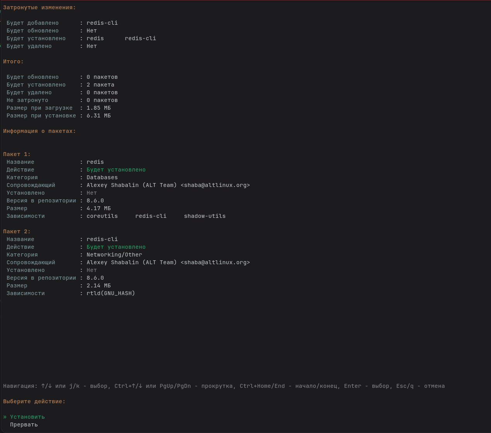
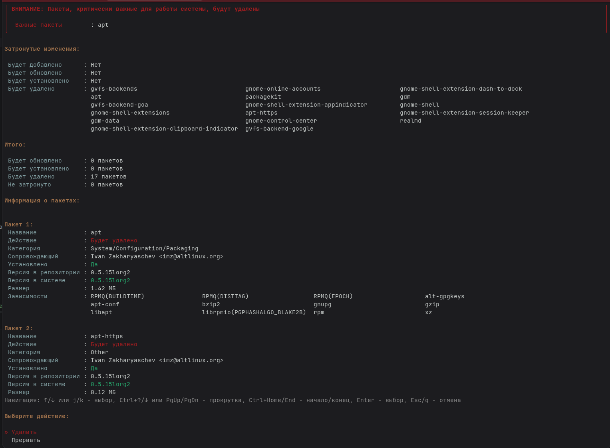

APM supports four operating modes:
* D-Bus service
* Console application with TUI
* HTTP API
* Support for atomic images (functionality and behavior model are determined automatically)

Two response formats:
* formatted text (Default)
* json (Optional, flag -f json)

> [!WARNING]
> When working with APM from an atomic image, the formatted text response (text) might be altered.

For detailed help after installation, run:
```
apm -help
```

## Installation
It is recommended to install the package from the repository:
```
apt-get install apm
```

For manual build:
```
apt-get install systemd-devel libapt-devel gettext-tools meson golang
meson setup build --wipe --prefix /usr
meson install -C build
```

## Translations
```
./po/create_pot
./po/update_po ru
```

## Tests
```
./scripts/test-container.sh all
```

General help:
```
apm -h

Module:
   apm - Atomic Package Manager

Commands:
   dbus-session  Start session D-Bus service org.altlinux.APM
   dbus-system   Start system D-Bus service org.altlinux.APM
   http-server   Start system HTTP API server
   http-session  Start session HTTP API server
   system, s     System package management
   repo, r       Repository management
   distrobox, d  Managing packages and containers in distrobox
   help, h       Show the list of commands or help for each command
   version, v    Show version

Options:
      --format, -f       Output format: json, text
      --transaction, -t  Internal property, adds the transaction to the output
      --help, -h         Show help
      --version, -v      Show version
```

## Configuration file
The config file does not exist by default, but can be created at `/etc/apm/config.yml`.

```yaml
# Prefix for launching all commands
commandPrefix: ""
# Runtime profile: dev or prod
environment: "prod"
# Path to the system package database
pathDBSQLSystem: ""
# Path to the distrobox package database
pathDBSQLUser: ""
# Output format type: tree or plain
formatType: "tree"

# Color scheme
colors:
    # Accent and heading color
    accent: "#a2734c"
    # Text color for light theme
    textLight: "#171717"
    # Text color for dark theme
    textDark: "#c4c8c6"

    # Tree branch color
    treeBranch: "#c4c8c6"
    # Error result color
    resultError: "9"

    # Dialog: positive action color (install, update)
    dialogAction: "#26a269"
    # Dialog: dangerous action color (remove)
    dialogDanger: "#a81c1f"
    # Dialog: hints and shortcuts color
    dialogHint: "#888888"
    # Dialog: scroll indicator color
    dialogScroll: "#ff0000"
    # Dialog: label color for light theme
    dialogLabelLight: "#234f55"
    # Dialog: label color for dark theme
    dialogLabelDark: "#82a0a3"

    # Progress bar: empty segment color
    progressEmpty: "#c4c8c6"
    # Progress bar: filled segment color
    progressFilled: "#26a269"
```

## D-Bus API

APM exports two D-Bus services named `org.altlinux.APM`. Full documentation: [DBUS_API](docs/DBUS_API.md)

### User session
When running in a user session, the service registers on the session D-Bus, which does not require additional privileges.
In this mode, APM works with distrobox containers. To view all methods, install D-SPY and find the APM service there.

```
apm dbus-session - run
apm distrobox dbus-doc - online documentation
```

### System session
In this mode, APM works with system packages. To view all methods, install D-SPY and find the APM service there.
```

sudo apm dbus-system - run
sudo apm system dbus-doc - online documentation
```

## HTTP API

APM provides HTTP servers with REST API, WebSocket events, and Swagger UI. Full documentation: [HTTP_API](docs/HTTP_API.md)

## Working with system packages
```
apm s

Module:
   apm system - System package management

Usage:
   apm system [command [command options]]

Commands:
   reinstall   Reinstall packages
   install     List of packages to install. Formats package- and package+ are supported.
   remove, rm  List of packages to remove
   update      Update package database
   upgrade     System image upgrade
   info        Package information
   search      Quick package search by name
   list        Build a query to retrieve the list of packages
   image, i    Module for working with the image
   dbus-doc    Show online D-Bus documentation

Options:
      --help, -h  Show help
```

### Installation
When operating from an atomic system, the flag -apply/-a becomes available. When specified, the package will be added to the system and the image will be rebuilt.

Example:
```
sudo apm s install zip
[✓] Package analysis
[✓] Loading package list from ALT repository
[✓] Progress: Loading all packages completed
[✓] Progress: Installing zip completed
[✓] Working with packages
[✓] Database synchronization
├── 1 package successfully installed and 0 upgraded.
│
╰── Information
    ├── Download size: 0.23 MB
    ├── Essential packages: none
    ├── Additionally installed: none
    ├── Install size: 0.69 MB
    ├── Number of newly installed: 1
    ├── Newly installed packages
    │   ╰── 1) zip
    ├── Number of removed: 0
    ├── Removed packages: none
    ├── Number of upgraded: 0
    ╰── Upgraded packages: none
```

If the output format is not specified as json and the request source is not D-Bus, a preliminary package analysis dialog is launched.




Result in json format:
```
apm s install zip -f json

{
  "data": {
    "message": "1 package successfully installed and 0 upgraded.",
    "info": {
      "extraInstalled": null,
      "upgradedPackages": null,
      "newInstalledPackages": [
        "zip"
      ],
      "removedPackages": null,
      "upgradedCount": 0,
      "newInstalledCount": 1,
      "removedCount": 0,
      "downloadSize": 245806,
      "installSize": 720012,
      "essentialPackages": null
    }
  },
  "error": null
}
```

### Removal
When operating from an atomic system, the flag -apply/-a becomes available. When specified, the package will be removed from the system and the image will be rebuilt.

Example:
```
sudo apm s remove zip
[✓] Package analysis
[✓] Progress: Loading all packages completed
[✓] Working with packages
[✓] Database synchronization
├── file-roller, zip successfully removed.
│
╰── Information
    ├── Download size: 0.00 MB
    ├── Essential packages: none
    ├── Additionally installed: none
    ├── Install size: 0.00 MB
    ├── Number of newly installed: 0
    ├── Newly installed packages: none
    ├── Number of removed: 2
    ├── Removed packages
    │   ├── 1) file-roller
    │   ╰── 2) zip
    ├── Number of upgraded: 0
    ╰── Upgraded packages: none
```

If the output format is not specified as json and the request source is not D-Bus, a preliminary package analysis dialog is launched.




Result in json format:
```
apm s remove zip -f json

{
  "data": null,
  "error": {
    "errorCode": "PERMISSION",
    "message": "Elevated privileges are required. Please use sudo or su"
  }
}
```

### Lists
Lists allow you to build complex queries through filtering and sorting.

```
apm s list -h

Module:
   apm system list - Build a query to retrieve the list of packages

Usage:
   apm system list [command [command options]]

Options:
      --sort                 Sort packages by field, example fields: name, section
      --order                Sort direction: ascending (ASC) or descending (DESC)
      --limit                Maximum number of returned records
      --offset               Starting position (offset) for the result set
      --filter [ --filter ]  Filter in the format key=value. The flag can be specified multiple times, e.g.: --filter name=zip --filter installed=true
      --force-update         Force update all packages before the query
      --full                 Full information output
      --help, -h             Show help
```

For example, to retrieve the heaviest package and display only one entry:
```
apm system list --sort="size" --order="DESC" -limit 1

├── Found 1 record
│
├── Packages
│   ╰── 1)
│       ├── Installed: no
│       ├── Maintainer: Artyom Bystrov <arbars@altlinux.org>
│       ├── Name: speed-dreams-data
│       ├── Summary: Game data for Speed Dreams
│       ╰── Version: 2.3.0
╰── Total: 45538
```

Or find all packages installed in the system and limit the output to one package:
```
apm system list --filter installed=true -limit 1

├── Found 1 record
│
├── Packages
│   ╰── 1)
│       ├── Installed: yes
│       ├── Maintainer: Paul Wolneykien <manowar@altlinux.org>
│       ├── Name: libjemalloc2
│       ├── Summary: A general-purpose scalable concurrent malloc(3) implementation
│       ╰── Version: 5.3.0
╰── Total: 1740

```

To build queries, it is better to view the response in json format to see the field names without formatting.


## Working with distrobox
```
apm d

Module:
   apm distrobox - Managing packages and containers in distrobox

Usage:
   apm distrobox [command [command options]]

Commands:
   update        Update and synchronize the list of installed packages with the host
   info          Package information
   search        Quick package search by name
   list          Build a query to retrieve the list of packages
   install       Install a package
   remove        Remove a package
   dbus-doc      Show online D-Bus documentation
   container, c  Module for working with containers

Options:
      --help, -h  Show help
```

### Adding a container

```
The image field supports three images: alt, arch, ubuntu
Adding an alt container:
apm distrobox c create --image alt
```

### Lists

The distrobox lists are built similarly to system packages:

```
apm distrobox list -h

Module:
   apm distrobox list - Build a query to retrieve the list of packages

Usage:
   apm distrobox list [command [command options]]

Options:
      --container, -c        Container name. Optional flag
      --sort                 Sort field, e.g.: name, version
      --order                Sort direction: ascending (ASC) or descending (DESC)
      --limit                Maximum number of returned records
      --offset               Starting position (offset) for the result set
      --filter [ --filter ]  Filter in the format key=value. The flag can be specified multiple times, e.g.: --filter name=zip --filter installed=true
      --force-update         Force update all packages before the query
      --help, -h             Show help
```

To get all packages for the container alt-software:

```
apm distrobox list -c alt-software -limit 1
[✓] Requesting container list
[✓] Requesting container information
[✓] Filtering packages
├── Found 1 record
│
├── Packages
│   ╰── 1)
│       ├── Container: alt-software
│       ├── Description: Libre realtime strategy game of ancient warfare
│       │   0 A.D. (pronounced "zero ey-dee") is a free software, cross-platform
│       │   real-time strategy (RTS) game of ancient warfare. In short, it is a
│       │   historically-based war/economy game that allows players to relive or
│       │   rewrite the history of Western civilizations, focusing on the years
│       │   between 500 B.C. and 500 A.D. The project is highly ambitious, involving
│       │   state-of-the-art 3D graphics, detailed artwork, sound, and a flexible
│       │   and powerful custom-built game engine.
│       ├── Exported: no
│       ├── Installed: no
│       ├── Package manager: apt-get
│       ├── Name: 0ad
│       ╰── Version: 0.27.1
╰── Total: 57415
```

## Working with an atomic image
This functionality is available only when working from an atomic image.

```
apm s image -h

Module:
   apm system image - Module for working with the image

Usage:
   apm system image [command [command options]]

Commands:
   build    Build image
   apply    Apply changes to the host
   status   Image status
   update   System image update
   history  Image change history

Options:
      --help, -h  Show help
```

APM abstracts away from the docker format and introduces a new yml format; the path to this file is specified in the configuration field pathImageFile.
This file will be used as the database for all image changes. To view the current state, run:
```
sudo apm s image status
├── Image status
│
╰── Loaded image
    ├── Configuration
    │   ├── Image: altlinux.space/alt-atomic/onyx-nvidia/stable:latest
    │   ╰── Modules
    │       ╰── 1)
    │           ├── body
    │           │   ╰── Install
    │           │       ╰── 1) tmux
    │           ├── Name: image-apply-results
    │           ╰── Type: packages
    ├── Image
    │   ├── Specification
    │   │   ╰── Image
    │   │       ├── Image: 5942c8885645
    │   │       ╰── Transport: containers-storage
    │   ╰── Status
    │       ├── Loaded
    │       │   ├── Image
    │       │   │   ├── Image
    │       │   │   │   ├── Image: 5942c8885645
    │       │   │   │   ╰── Transport: containers-storage
    │       │   │   ├── Image digest: sha256:b431df1948d2112f01a38ca6b23762dc3469a687a90fb51b61a8fe676abc36d6
    │       │   │   ├── Date: 2026-02-22T07:24:20.671370656Z
    │       │   │   ╰── Version: none
    │       │   ├── Pinned: no
    │       │   ╰── Storage type: ostreeContainer
    │       ╰── Committed: no
    ╰── Status: Image modified. Configuration file: /etc/apm/image.yml
```

You will see the path to the configuration file, for example:

```
cat /etc/apm/image.yml

image: ghcr.io/alt-gnome/alt-atomic:latest-nv
packages:
    install:
        - memcached
        - redis
    remove: []
commands: []
```

All operations for installing and removing packages with the -apply flag will be recorded in this file. You can also edit it manually, then run:
```
sudo apm s image apply

⚛
├── Changes successfully applied. A reboot is required
╰── Loaded image
    ├── Configuration
    │   ├── Commands: []
    │   ├── Image: ghcr.io/alt-gnome/alt-atomic:latest-nv
    │   ╰── Packages
    │       ├── Install
    │       │   ╰── 1) redis
    │       ╰── Remove: []
    ├── Image
    │   ├── Specification
    │   │   ╰── Image
    │   │       ├── Image: 709986e6f957
    │   │       ╰── Transport: containers-storage
    │   ╰── Status
    │       ├── Loaded
    │       │   ├── Image
    │       │   │   ├── Image
    │       │   │   │   ├── Image: ghcr.io/alt-gnome/alt-atomic:latest-nv
    │       │   │   │   ╰── Transport: containers-storage
    │       │   │   ├── Image hash: sha256:57f696c0ea4a69d877e22c916ee46c4c2f8b9045154fc6ca58ee8419df7d3af2
    │       │   │   ├── Date: 2025-03-12T12:11:08.245328960Z
    │       │   │   ╰── Version: none
    │       │   ├── Pinned: no
    │       │   ╰── Storage type: ostreeContainer
    │       ╰── In queue
    │           ├── Image
    │           │   ├── Image
    │           │   │   ├── Image: 709986e6f957
    │           │   │   ╰── Transport: containers-storage
    │           │   ├── Image hash: sha256:9e22138e231369fe3fc4c5737aa81e37ab79e0661c6beb3691709fe99f250655
    │           │   ├── Date: 2025-03-12T17:48:46.335015764Z
    │           │   ╰── Version: none
    │           ├── Pinned: no
    │           ╰── Storage type: ostreeContainer
    ╰── Status: Modified image. Configuration file: /etc/apm/image.yml
```

All image changes are recorded. To view the history of the last two entries, run:

```
sudo apm s image history -limit 2

⚛
├── Found 2 records
├── History
│   ├── 1)
│   │   ├── Configuration
│   │   │   ├── Commands: []
│   │   │   ├── Image: ghcr.io/alt-gnome/alt-atomic:latest-nv
│   │   │   ╰── Packages
│   │   │       ├── Install
│   │   │       │   ╰── 1) redis
│   │   │       ╰── Remove: []
│   │   ├── Date: 2025-03-12T23:50:17+06:00
│   │   ╰── Image: ghcr.io/alt-gnome/alt-atomic:latest-nv
│   ╰── 2)
│       ├── Configuration
│       │   ├── Commands: []
│       │   ├── Image: ghcr.io/alt-gnome/alt-atomic:latest-nv
│       │   ╰── Packages
│       │       ├── Install
│       │       │   ╰── 1) redis
│       │       ╰── Remove
│       │           ╰── 1) memcached
│       ├── Date: 2025-03-12T23:49:00+06:00
│       ╰── Image: ghcr.io/alt-gnome/alt-atomic:latest-nv
╰── Total records: 3
```
