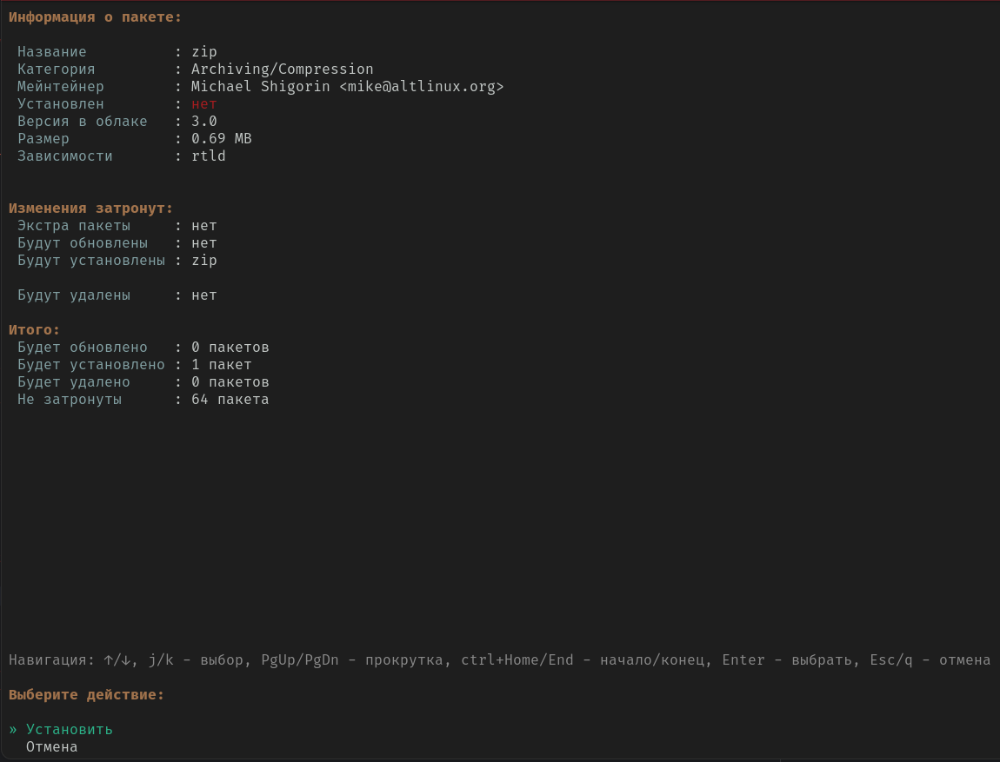

APM supports three operating modes:
* DBUS service
* Console application
Support for atomic images (functionality and behavior model are determined automatically)

Two response formats:
* formatted text (Default)
* json (Optional, flag -f json)

> [!WARNING]
> When working with APM from an atomic image, the formatted text response (text) might be altered.

For detailed help after installation, run:
```
apm -help
```

## Configuration file
The config.conf file does not exist by default, but can be created using the /etc/apm/config.yml path. It can contain the following parameters in yml format:

* commandPrefix - prefix for launching all commands
* environment - runtime profile. `dev` or `prod`
* pathLogFile - the path to the logs file
* pathDBSQLSystem - the path to the system package database
* pathDBSQLUser - path to the package database from distrobox
* pathDBKV - path to the app icons database
* pathImageFile - path to the image configuration file

## Installation
APM has not yet been added to the ALT repository. To install the current version, run in the console:

```
meson setup build --wipe --prefix /usr
meson install -C build
```

General help:
```
apm -h

Module:
   apm - Atomic Package Manager

Usage:
   apm [command [command options]]

Commands:
   dbus-session  Start session D-Bus service org.altlinux.APM
   dbus-system   Start system D-Bus service org.altlinux.APM
   system, s     System package management
   distrobox, d  Managing packages and containers in distrobox
   help, h       Show the list of commands or help for each command

Options:
   --format value, -f value       Output format: json, text (default: "text")
   --transaction value, -t value  Internal property, adds the transaction to the output
   --help, -h                     show help

```


## User DBUS Session
When running in a user session, the service is registered on the session bus, which does not require additional privileges. In this mode, APM works with distrobox containers. 
To view all methods, for example, install D-SPY and then find the APM service there

```
apm dbus-session
```

## System DBUS Session
For proper operation, you need to apply the access policy by copying the file apm.conf. In this mode, APM works with system packages. 
To view all methods, for example, install D-SPY and then find the APM service there

```
sudo cp data/dbus-config/apm.conf /etc/dbus-1/system.d/

sudo apm dbus-system
```

## Example of working with system packages
```
apm s

NAME:
   apm system - Manage system packages

USAGE:
   apm system [command [command options]] 

COMMANDS:
   install     List of packages to install
   remove, rm  List of packages to remove
   update      Update the package database
   upgrade     Overall system upgrade
   info        Package information
   search      Quick package search by name
   list        Build a query to retrieve the list of packages
   image, i    Module for working with the image

OPTIONS:
   --help, -h  show help

```

### Installation
When operating from an atomic system, the flag -apply/-a becomes available. 
When specified, the package will be added to the system and the image will be rebuilt.

Example query:
```
apm s install zip

⚛
├── zip successfully removed.
╰── Information
    ├── Additionally installed: none
    ├── Number of new installations: 0
    ├── Newly installed packages: none
    ├── Number of not updated: 64
    ├── Number of removed: 1
    ├── Removed packages
    │   ╰── 1) zip
    ├── Number of updated: 0
    ╰── Updated packages: none
```

If the output format is not specified as json and the query source is not DBUS, a preliminary dialog for package analysis for installation is launched



Result of execution in json format:
```
apm s install zip -f json

{
  "data": {
    "info": {
      "extraInstalled": null,
      "upgradedPackages": null,
      "newInstalledPackages": [
        "zip"
      ],
      "removedPackages": null,
      "upgradedCount": 0,
      "newInstalledCount": 1,
      "removedCount": 0,
      "notUpgradedCount": 64
    }
  },
  "error": false
}
```

### Removal
When operating from an atomic system, the flag -apply/-a becomes available. When specified, the package will be removed from the system and the image will be rebuilt.

Example query:
```
apm s remove zip

⚛
├── zip successfully removed.
╰── Information
    ├── Additionally installed: none
    ├── Number of new installations: 0
    ├── Newly installed packages: none
    ├── Number of not updated: 64
    ├── Number of removed: 1
    ├── Removed packages
    │   ╰── 1) zip
    ├── Number of updated: 0
    ╰── Updated packages: none
    
```

If the output format is not specified as json and the query source is not DBUS, a preliminary dialog for package analysis for removal is launched


Result of execution in json format:
```
apm s remove zip -f json

{
  "data": {
    "info": {
      "extraInstalled": null,
      "upgradedPackages": null,
      "newInstalledPackages": null,
      "removedPackages": [
        "zip"
      ],
      "upgradedCount": 0,
      "newInstalledCount": 0,
      "removedCount": 1,
      "notUpgradedCount": 64
    }
  },
  "error": false
}

```

### Lists
Lists allow you to build complex queries through filtering and sorting

```
apm s list -h
     
NAME:
   apm system list - Build a query to retrieve the list of packages

USAGE:
   apm system list [command [command options]]

OPTIONS:
   --sort value                       Field for sorting, for example: name, installed
   --order value                      Sorting order: ASC or DESC (default: "ASC")
   --limit value                      Query limit (default: 10)
   --offset value                     Query offset (default: 0)
   --filter value [ --filter value ]  Filter in the format key=value. The flag can be specified multiple times, for example: --filter name=zip --filter installed=true
   --force-update                     Force update all packages before the query (default: false)
   --full                             Full output of information (default: false)
   --help, -h                         show help

GLOBAL OPTIONS:
   --format value, -f value       Output format: json, text (default: "text")
   --transaction value, -t value  Internal property, adds a transaction to the output
```

For example, to retrieve the heaviest package and display only one entry:
```
apm system list --sort="size" --order="DESC" -limit 1

⚛
├── Found 1 record
├── Packages
│   ╰── 1)
│       ├── Dependencies
│       │   ╰── 1) speed-dreams
│       ├── Description: Game data for Speed Dreams                     
│       │   Speed Dreams is a fork of the racing car simulator Torcs,
│       │   with some new features.                                  
│       ├── Filename: speed-dreams-data-2.3.0-alt1.x86_64.rpm
│       ├── Installed: no
│       ├── Disk space required: 2722.10 MB
│       ├── Maintainer: Artyom Bystrov <arbars@altlinux.org>
│       ├── Name: speed-dreams-data
│       ├── Section: Games/Sports
│       ├── Size: 1942.57 MB
│       ├── Version: 2.3.0
│       ╰── Installed version: no
╰── Total records: 53865
```

Or to find all packages installed in the system and limit the output to one package:
```
apm system list --filter installed=true -limit 1

⚛
├── Found 1 record
├── Packages
│   ╰── 1)
│       ├── Dependencies
│       │   ├── 9) perl
│       │   ├── 10) perl-base
│       │   ╰── 11) rtld
│       ├── Description: Parts of the groff formatting system that is required for viewing manpages
│       │   A stripped-down groff package containing the components required                    
│       │   to view man pages in ASCII, Latin-1 and UTF-8.                                      
│       ├── Filename: groff-base-1.22.3-alt2.x86_64.rpm
│       ├── Installed: yes
│       ├── Disk space required: 3.19 MB
│       ├── Maintainer: Alexey Gladkov <legion@altlinux.ru>
│       ├── Package name: groff-base
│       ├── Section: Text tools
│       ├── Size: 0.83 MB
│       ├── Version: 1.22.3
│       ╰── Installed version: 1.22.3
╰── Total records: 1594
```

To build queries, it is better to view the response in json format to see the field names without formatting.

## Example of working with distrobox
```
apm d                                    
NAME:
   apm distrobox - Manage distrobox packages and containers

USAGE:
   apm distrobox [command [command options]] 

COMMANDS:
   update        Update and synchronize the list of installed packages with the host
   info          Package information
   search        Quick package search by name
   list          Build a query to retrieve the list of packages
   install       Install a package
   remove, rm    Remove a package
   container, c  Module for working with containers

OPTIONS:
   --help, -h  show help
```

### Adding a container

```
The image field supports three images: alt, arch, ubuntu
Adding an alt container:
apm distrobox c create --image alt
```

### Lists

The distrobox lists are built similarly to system packages, description:

```
apm distrobox list -h       
             
NAME:
   apm distrobox list - Build a query to retrieve the list of packages

USAGE:
   apm distrobox list [command [command options]]

OPTIONS:
   --container value, -c value        Container name. Must be specified
   --sort value                       Field for sorting, for example: name, version
   --order value                      Sorting order: ASC or DESC (default: "ASC")
   --limit value                      Query limit (default: 10)
   --offset value                     Query offset (default: 0)
   --filter value [ --filter value ]  Filter in the format key=value. The flag can be specified multiple times, for example: --filter name=zip --filter installed=true
   --force-update                     Force update all packages before the query (default: false)
   --help, -h                         show help

GLOBAL OPTIONS:
   --format value, -f value       Output format: json, text (default: "text")
   --transaction value, -t value  Internal property, adds a transaction to the output
```

To get all packages for the container atomic-alt:

```
apm distrobox list -c atomic-alt -limit 1

⚛
├── Found 1 record
├── Packages
│   ╰── 1)
│       ├── Description: Libraries and header files for LLVM                       
│       │   This package contains library and header files needed to develop new
│       │   native programs that use the LLVM infrastructure.                   
│       ├── Exported: no
│       ├── Installed: no
│       ├── Package manager: apt-get
│       ├── Package name: llvm14.0-devel
│       ╰── Version: 14.0.6
╰── Total records: 53865
```

## Working with an atomic image
This functionality is available only when working from an atomic image

```
apm s image -h

NAME:
   apm system image - Module for working with the image

USAGE:
   apm system image [command [command options]] 

COMMANDS:
   apply    Apply changes to the host
   status   Image status
   update   Update the image
   history  Image change history

OPTIONS:
   --help, -h  show help
```

APM abstracts away from the docker format and introduces a new yml format; the path to this file is specified in the configuration field pathImageFile. 
This file will be used as the database for all image changes. To view the current state, run:
```
sudo apm s image status

⚛
├── Image status
╰── Loaded image
    ├── Configuration
    │   ├── Commands: []
    │   ├── Image: ghcr.io/alt-gnome/alt-atomic:latest-nv
    │   ╰── Packages
    │       ├── Install
    │       │   ╰── 1) redis
    │       ╰── Remove: []
    ├── Image
    │   ├── Specification
    │   │   ╰── Image
    │   │       ├── Image: a88583f54c8e
    │   │       ╰── Transport: containers-storage
    │   ╰── Status
    │       ├── Loaded
    │       │   ├── Image
    │       │   │   ├── Image
    │       │   │   │   ├── Image: ghcr.io/alt-gnome/alt-atomic:latest-nv
    │       │   │   │   ╰── Transport: containers-storage
    │       │   │   ├── Image hash: sha256:57f696c0ea4a69d877e22c916ee46c4c2f8b9045154fc6ca58ee8419df7d3af2
    │       │   │   ├── Date: 2025-03-12T12:11:08.245328960Z
    │       │   │   ╰── Version: none
    │       │   ├── Pinned: no
    │       │   ╰── Storage type: ostreeContainer
    │       ╰── In queue
    │           ├── Image
    │           │   ├── Image
    │           │   │   ├── Image: a88583f54c8e
    │           │   │   ╰── Transport: containers-storage
    │           │   ├── Image hash: sha256:21ccfa2b5c6793d0bc9074f0725f45e771706123c8cbd4cb6bbc53b50466aef9
    │           │   ├── Date: 2025-03-12T16:36:51.054268321Z
    │           │   ╰── Version: none
    │           ├── Pinned: no
    │           ╰── Storage type: ostreeContainer
    ╰── Status: Modified image. Configuration file: /etc/apm/image.yml
```

You will see the path to the configuration file, for example:

```
cat /etc/apm/image.yml

image: ghcr.io/alt-gnome/alt-atomic:latest-nv
packages:
    install:
        - memcached
        - redis
    remove: []
commands: []
```

All operations for installing and removing packages with the flag -apply will be recorded in this file, and you can also edit it manually, then run the following command:
```
sudo apm s image apply

⚛
├── Changes successfully applied. A reboot is required
╰── Loaded image
    ├── Configuration
    │   ├── Commands: []
    │   ├── Image: ghcr.io/alt-gnome/alt-atomic:latest-nv
    │   ╰── Packages
    │       ├── Install
    │       │   ╰── 1) redis
    │       ╰── Remove: []
    ├── Image
    │   ├── Specification
    │   │   ╰── Image
    │   │       ├── Image: 709986e6f957
    │   │       ╰── Transport: containers-storage
    │   ╰── Status
    │       ├── Loaded
    │       │   ├── Image
    │       │   │   ├── Image
    │       │   │   │   ├── Image: ghcr.io/alt-gnome/alt-atomic:latest-nv
    │       │   │   │   ╰── Transport: containers-storage
    │       │   │   ├── Image hash: sha256:57f696c0ea4a69d877e22c916ee46c4c2f8b9045154fc6ca58ee8419df7d3af2
    │       │   │   ├── Date: 2025-03-12T12:11:08.245328960Z
    │       │   │   ╰── Version: none
    │       │   ├── Pinned: no
    │       │   ╰── Storage type: ostreeContainer
    │       ╰── In queue
    │           ├── Image
    │           │   ├── Image
    │           │   │   ├── Image: 709986e6f957
    │           │   │   ╰── Transport: containers-storage
    │           │   ├── Image hash: sha256:9e22138e231369fe3fc4c5737aa81e37ab79e0661c6beb3691709fe99f250655
    │           │   ├── Date: 2025-03-12T17:48:46.335015764Z
    │           │   ╰── Version: none
    │           ├── Pinned: no
    │           ╰── Storage type: ostreeContainer
    ╰── Status: Modified image. Configuration file: /etc/apm/image.yml
```

All image changes are recorded. To view the history of the last two entries, run:

```
sudo apm s image history -limit 2

⚛
├── Found 2 records
├── History
│   ├── 1)
│   │   ├── Configuration
│   │   │   ├── Commands: []
│   │   │   ├── Image: ghcr.io/alt-gnome/alt-atomic:latest-nv
│   │   │   ╰── Packages
│   │   │       ├── Install
│   │   │       │   ╰── 1) redis
│   │   │       ╰── Remove: []
│   │   ├── Date: 2025-03-12T23:50:17+06:00
│   │   ╰── Image: ghcr.io/alt-gnome/alt-atomic:latest-nv
│   ╰── 2)
│       ├── Configuration
│       │   ├── Commands: []
│       │   ├── Image: ghcr.io/alt-gnome/alt-atomic:latest-nv
│       │   ╰── Packages
│       │       ├── Install
│       │       │   ╰── 1) redis
│       │       ╰── Remove
│       │           ╰── 1) memcached
│       ├── Date: 2025-03-12T23:49:00+06:00
│       ╰── Image: ghcr.io/alt-gnome/alt-atomic:latest-nv
╰── Total records: 3
```
