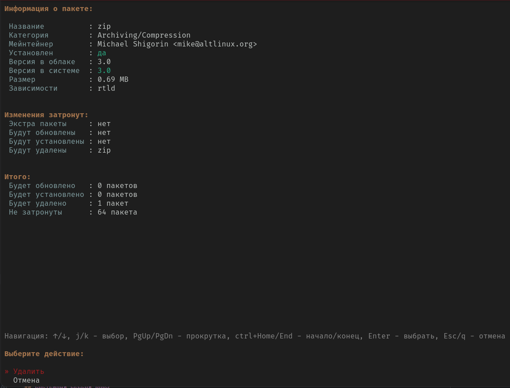

APM поддерживает три режима работы:
* DBUS-сервис
* Консольное приложение
* Поддержка атомарных образов (функционал и модель поведения определяется автоматически)

Два формата ответов:
* форматированный text (Стандартное значение)
* json (Опционально, флаг -f json)

> [!WARNING]
> При работе с APM из атомарного образа форматированный текстовый ответ (text) может быть изменён.

Для подробной справки после установки вызовите:
```
apm -help
```

## Установка
APM пока не добавлен в репозиторий ALT. Для установки текущей версии выполните в консоли:

```
curl -fsSL https://raw.githubusercontent.com/alt-atomic/apm/main/data/install.sh | sudo bash
```

Общая справка:
```
apm -h

NAME:
   apm - Atomic Package Manager

USAGE:
   apm [global options] [command [command options]]

COMMANDS:
   dbus-session  Запуск сессии D-Bus service com.application.APM
   dbus-system   Запуск системной сессии D-Bus service com.application.APM
   system, s     Управление системными пакетами
   distrobox, d  Управление пакетами и контейнерами distrobox
   help, h       Показать список команд или справку по каждой команде

GLOBAL OPTIONS:
   --format value, -f value       Формат вывода: json, text (default: "text")
   --transaction value, -t value  Внутреннее свойство, добавляет транзакцию к выводу
   --help, -h                     show help
```


## Пользовательская сессия DBUS
При запуске в пользовательской сессии сервис регистрируется в сессионной шине DBUS, что не требует дополнительных привилегий.
В этом режиме APM работает с контейнерами distrobox, для просмотра всех методов установите, например, D-SPY и найдите там сервис APM

```
apm dbus-session
```

## Системная сессия DBUS
Для корректной работы необходимо применить политику доступа путём копирования файла apm.conf.
В этом режиме APM работает с системными пакетами, для просмотра всех методов установите, например, D-SPY и найдите там сервис APM
```
sudo cp data/dbus-config/apm.conf /etc/dbus-1/system.d/

sudo apm dbus-system
```

## Пример работы с системными пакетами
```
apm s

NAME:
   apm system - Управление системными пакетами

USAGE:
   apm system [command [command options]] 

COMMANDS:
   install     Список пакетов на установку
   remove, rm  Список пакетов на удаление
   update      Обновление пакетной базы
   upgrade     Общее обновление системы
   info        Информация о пакете
   search      Быстрый поиск пакетов по названию
   list        Построение запроса для получения списка пакетов
   image, i    Модуль для работы с образом

OPTIONS:
   --help, -h  show help

```

### Установка
При работе из атомарной системы становится доступен флаг -apply/-a. При указании данного флага пакет будет добавлен в систему, а образ пересобран.

Пример запроса:
```
apm s install zip

⚛
├── zip успешно удалён.
╰── Информация
    ├── Дополнительно установлено: нет
    ├── Количество новых установок: 0
    ├── Новые установленные пакеты: нет
    ├── Количество не обновленных: 64
    ├── Количество удаленных: 1
    ├── Удаленные пакеты
    │   ╰── 1) zip
    ├── Количество обновленных: 0
    ╰── Обновленные пакеты: нет
```

Если формат ответ не указан как json и источником запроса не является DBUS - запускается диалог предварительного анализа пакетов для установки


Результат выполнения в формате json:
```
apm s install zip -f json

{
  "data": {
    "info": {
      "extraInstalled": null,
      "upgradedPackages": null,
      "newInstalledPackages": [
        "zip"
      ],
      "removedPackages": null,
      "upgradedCount": 0,
      "newInstalledCount": 1,
      "removedCount": 0,
      "notUpgradedCount": 64
    }
  },
  "error": false
}
```

### Удаление
При работе из атомарной системы становится доступен флаг -apply/-a. При указании данного флага пакет будет добавлен в систему, а образ пересобран.

Пример запроса:
```
apm s remove zip

⚛
├── zip успешно удалён.
╰── Информация
    ├── Дополнительно установлено: нет
    ├── Количество новых установок: 0
    ├── Новые установленные пакеты: нет
    ├── Количество не обновленных: 64
    ├── Количество удаленных: 1
    ├── Удаленные пакеты
    │   ╰── 1) zip
    ├── Количество обновленных: 0
    ╰── Обновленные пакеты: нет
    
```

Если формат ответ не указан как json и источником запроса не является DBUS - запускается диалог предварительного анализа пакетов для удаления




Результат выполнения в формате json:
```
apm s remove zip -f json

{
  "data": {
    "info": {
      "extraInstalled": null,
      "upgradedPackages": null,
      "newInstalledPackages": null,
      "removedPackages": [
        "zip"
      ],
      "upgradedCount": 0,
      "newInstalledCount": 0,
      "removedCount": 1,
      "notUpgradedCount": 64
    }
  },
  "error": false
}

```

### Списки
Списки позволяют выстраивать сложные запросы путём фильтрации и сортировки

```
apm s list -h
     
NAME:
   apm system list - Построение запроса для получения списка пакетов

USAGE:
   apm system list [command [command options]]

OPTIONS:
   --sort value                       Поле для сортировки, например: name, installed
   --order value                      Порядок сортировки: ASC или DESC (default: "ASC")
   --limit value                      Лимит выборки (default: 10)
   --offset value                     Смещение выборки (default: 0)
   --filter value [ --filter value ]  Фильтр в формате key=value. Флаг можно указывать несколько раз, например: --filter name=zip --filter installed=true
   --force-update                     Принудительно обновить все пакеты перед запросом (default: false)
   --full                             Полный вывод информации (default: false)
   --help, -h                         show help

GLOBAL OPTIONS:
   --format value, -f value       Формат вывода: json, text (default: "text")
   --transaction value, -t value  Внутреннее свойство, добавляет транзакцию к выводу
```

Например, что бы достать самый "тяжелый" пакет и отобразить только одну запись:
```
apm system list --sort="size" --order="DESC" -limit 1

⚛
├── Найдена 1 запись
├── Пакеты
│   ╰── 1)
│       ├── Зависимости
│       │   ╰── 1) speed-dreams
│       ├── Описание: Game data for Speed Dreams                     
│       │   Speed Dreams ia a fork of the racing car simulator Torcs,
│       │   with some new features.                                  
│       ├── Имя файла: speed-dreams-data-2.3.0-alt1.x86_64.rpm
│       ├── Установлено: нет
│       ├── Займёт на диске: 2722.10 MB
│       ├── Мэйнтейнер: Artyom Bystrov <arbars@altlinux.org>
│       ├── Название: speed-dreams-data
│       ├── Раздел: Games/Sports
│       ├── Размер: 1942.57 MB
│       ├── Версия: 2.3.0
│       ╰── Установленная версия: нет
╰── Всего записей: 53865
```

Или найти все пакеты установленные в системе и ограничить вывод одним пакетом:
```
apm system list --filter installed=true -limit 1

⚛
├── Найдена 1 запись
├── Пакеты
│   ╰── 1)
│       ├── Зависимости
│       │   ├── 9) perl
│       │   ├── 10) perl-base
│       │   ╰── 11) rtld
│       ├── Описание: Parts of the groff formatting system that is required for viewing manpages
│       │   A stripped-down groff package containing the components required                    
│       │   to view man pages in ASCII, Latin-1 and UTF-8.                                      
│       ├── Имя файла: groff-base-1.22.3-alt2.x86_64.rpm
│       ├── Установлено: да
│       ├── Займёт на диске: 3.19 MB
│       ├── Мэйнтейнер: Alexey Gladkov <legion@altlinux.ru>
│       ├── Название: groff-base
│       ├── Раздел: Text tools
│       ├── Размер: 0.83 MB
│       ├── Версия: 1.22.3
│       ╰── Установленная версия: 1.22.3
╰── Всего записей: 1594
```

Для построения запросов лучше посмотреть ответ в формате json что бы увидеть названия полей не отформатированные выводом.


## Пример работы с distrobox
```
apm d                                    
NAME:
   apm distrobox - Управление пакетами и контейнерами distrobox

USAGE:
   apm distrobox [command [command options]] 

COMMANDS:
   update        Обновить и синхронизировать списки установленных пакетов с хостом
   info          Информация о пакете
   search        Быстрый поиск пакетов по названию
   list          Построение запроса для получения списка пакетов
   install       Установить пакет
   remove, rm    Удалить пакет
   container, c  Модуль для работы с контейнерами

OPTIONS:
   --help, -h  show help
```

### Добавление контейнера

```
Поле image поддерживает три образа: alt, arch, ubuntu
Добавление контейнера alt:
apm distrobox c create --image alt
```

### Списки

Списки для distrobox построены схожим образом с системными пакетами, описание:

```
apm distrobox list -h       
             
NAME:
   apm distrobox list - Построение запроса для получения списка пакетов

USAGE:
   apm distrobox list [command [command options]]

OPTIONS:
   --container value, -c value        Название контейнера. Необходимо указать
   --sort value                       Поле для сортировки, например: name, version
   --order value                      Порядок сортировки: ASC или DESC (default: "ASC")
   --limit value                      Лимит выборки (default: 10)
   --offset value                     Смещение выборки (default: 0)
   --filter value [ --filter value ]  Фильтр в формате key=value. Флаг можно указывать несколько раз, например: --filter name=zip --filter installed=true
   --force-update                     Принудительно обновить все пакеты перед запросом (default: false)
   --help, -h                         show help

GLOBAL OPTIONS:
   --format value, -f value       Формат вывода: json, text (default: "text")
   --transaction value, -t value  Внутреннее свойство, добавляет транзакцию к выводу
```

Для получения всех пакетов контейнера atomic-alt:

```
apm distrobox list -c atomic-alt -limit 1

⚛
├── Найдена 1 запись
├── Пакеты
│   ╰── 1)
│       ├── Описание: Libraries and header files for LLVM                       
│       │   This package contains library and header files needed to develop new
│       │   native programs that use the LLVM infrastructure.                   
│       ├── Экспортировано: нет
│       ├── Установлено: нет
│       ├── Пакетный менеджер: apt-get
│       ├── Название пакета: llvm14.0-devel
│       ╰── Версия: 14.0.6
╰── Всего записей: 53865
```

## Работа с атомарным образом
Данный функционал доступен только при работе из атомарного образа

```
apm s image -h

NAME:
   apm system image - Модуль для работы с образом

USAGE:
   apm system image [command [command options]] 

COMMANDS:
   apply    Применить изменения к хосту
   status   Статус образа
   update   Обновление образа
   history  История изменений образа

OPTIONS:
   --help, -h  show help
```

APM абстрагируется от docker-формата и вводит новый формат yml, путь к этому файлу указывается в конфигурации, поле pathImageFile.
Данный файл будет использован в качестве базы данных всех изменений образа, что бы посмотреть текущее состояние вызовите:
```
sudo apm s image status

⚛
├── Статус образа
╰── Загруженный образ
    ├── Конфигурация
    │   ├── Команды: []
    │   ├── Образ: ghcr.io/alt-gnome/alt-atomic:latest-nv
    │   ╰── Пакеты
    │       ├── Установить
    │       │   ╰── 1) redis
    │       ╰── Удалить: []
    ├── Образ
    │   ├── Спецификация
    │   │   ╰── Образ
    │   │       ├── Образ: a88583f54c8e
    │   │       ╰── Транспорт: containers-storage
    │   ╰── Статус
    │       ├── Загруженный
    │       │   ├── Образ
    │       │   │   ├── Образ
    │       │   │   │   ├── Образ: ghcr.io/alt-gnome/alt-atomic:latest-nv
    │       │   │   │   ╰── Транспорт: containers-storage
    │       │   │   ├── Хэш образа: sha256:57f696c0ea4a69d877e22c916ee46c4c2f8b9045154fc6ca58ee8419df7d3af2
    │       │   │   ├── Дата: 2025-03-12T12:11:08.245328960Z
    │       │   │   ╰── Версия: нет
    │       │   ├── Закреплён: нет
    │       │   ╰── Тип хранилища: ostreeContainer
    │       ╰── В очереди
    │           ├── Образ
    │           │   ├── Образ
    │           │   │   ├── Образ: a88583f54c8e
    │           │   │   ╰── Транспорт: containers-storage
    │           │   ├── Хэш образа: sha256:21ccfa2b5c6793d0bc9074f0725f45e771706123c8cbd4cb6bbc53b50466aef9
    │           │   ├── Дата: 2025-03-12T16:36:51.054268321Z
    │           │   ╰── Версия: нет
    │           ├── Закреплён: нет
    │           ╰── Тип хранилища: ostreeContainer
    ╰── Статус: Изменённый образ. Файл конфигурации: /etc/apm/image.yml
```

Вы увидите путь к конфигурационному файлу, например:

```
cat /etc/apm/image.yml

image: ghcr.io/alt-gnome/alt-atomic:latest-nv
packages:
    install:
        - memcached
        - redis
    remove: []
commands: []
```

Все операции по установке и удалению пакетов с флагом -apply буду записаны в данный файл, так же его можно редактировать вручную, затем вызывать следующую команду:
```
sudo apm s image apply

⚛
├── Изменения успешно применены. Необходима перезагрузка
╰── Загруженный образ
    ├── Конфигурация
    │   ├── Команды: []
    │   ├── Образ: ghcr.io/alt-gnome/alt-atomic:latest-nv
    │   ╰── Пакеты
    │       ├── Установить
    │       │   ╰── 1) redis
    │       ╰── Удалить: []
    ├── Образ
    │   ├── Спецификация
    │   │   ╰── Образ
    │   │       ├── Образ: 709986e6f957
    │   │       ╰── Транспорт: containers-storage
    │   ╰── Статус
    │       ├── Загруженный
    │       │   ├── Образ
    │       │   │   ├── Образ
    │       │   │   │   ├── Образ: ghcr.io/alt-gnome/alt-atomic:latest-nv
    │       │   │   │   ╰── Транспорт: containers-storage
    │       │   │   ├── Хэш образа: sha256:57f696c0ea4a69d877e22c916ee46c4c2f8b9045154fc6ca58ee8419df7d3af2
    │       │   │   ├── Дата: 2025-03-12T12:11:08.245328960Z
    │       │   │   ╰── Версия: нет
    │       │   ├── Закреплён: нет
    │       │   ╰── Тип хранилища: ostreeContainer
    │       ╰── В очереди
    │           ├── Образ
    │           │   ├── Образ
    │           │   │   ├── Образ: 709986e6f957
    │           │   │   ╰── Транспорт: containers-storage
    │           │   ├── Хэш образа: sha256:9e22138e231369fe3fc4c5737aa81e37ab79e0661c6beb3691709fe99f250655
    │           │   ├── Дата: 2025-03-12T17:48:46.335015764Z
    │           │   ╰── Версия: нет
    │           ├── Закреплён: нет
    │           ╰── Тип хранилища: ostreeContainer
    ╰── Статус: Изменённый образ. Файл конфигурации: /etc/apm/image.yml
```

Все изменения образа фиксируются, для просмотра истории последних двух записей вызовите:

```
sudo apm s image history -limit 2

⚛
├── Найдено 2 записи
├── История
│   ├── 1)
│   │   ├── Конфигурация
│   │   │   ├── Команды: []
│   │   │   ├── Образ: ghcr.io/alt-gnome/alt-atomic:latest-nv
│   │   │   ╰── Пакеты
│   │   │       ├── Установить
│   │   │       │   ╰── 1) redis
│   │   │       ╰── Удалить: []
│   │   ├── Дата: 2025-03-12T23:50:17+06:00
│   │   ╰── Образ: ghcr.io/alt-gnome/alt-atomic:latest-nv
│   ╰── 2)
│       ├── Конфигурация
│       │   ├── Команды: []
│       │   ├── Образ: ghcr.io/alt-gnome/alt-atomic:latest-nv
│       │   ╰── Пакеты
│       │       ├── Установить
│       │       │   ╰── 1) redis
│       │       ╰── Удалить
│       │           ╰── 1) memcached
│       ├── Дата: 2025-03-12T23:49:00+06:00
│       ╰── Образ: ghcr.io/alt-gnome/alt-atomic:latest-nv
╰── Всего записей: 3
```
